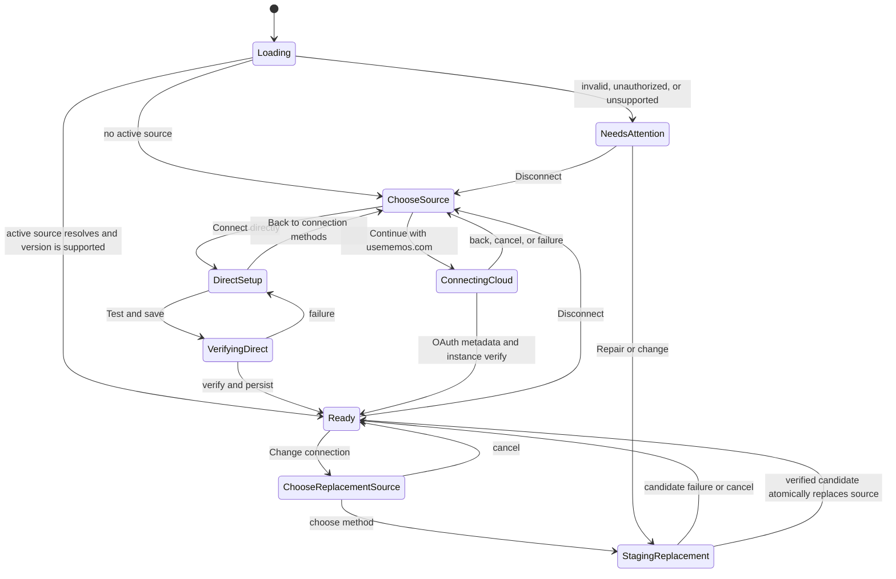

# Direct and usememos.com connection sources

Status: Implemented

Issue: [#2 — Support direct connection with an instance URL and access token](https://github.com/usememos/web-clipper/issues/2)

## Summary

The clipper will support two explicit ways to obtain a Memos instance URL and access token:

1. **usememos.com (Recommended)** — the current OAuth flow. The extension signs in to usememos.com and reads the instance URL and access token attached to that account. The account-backed connection information can be loaded after signing in on another device.
2. **Direct connection** — the user enters an instance URL and a Memos personal access token (PAT) in the extension. No usememos.com account is required, and the connection stays on this browser.

Both flows resolve to the same background-only `ResolvedConnection`. The popup, options renderer, and content scripts receive only sanitized connection state; they never receive a saved PAT.

When no connection exists, the settings page starts with an explicit choice between the two methods. **Sign in with usememos.com** is listed first and marked **Recommended** because the connection information is attached to the account and can be loaded after signing in on another device. **Direct connection** is the second choice for users who want a device-local setup without a usememos.com account. The instance URL and PAT fields appear only after the user chooses direct connection.

## Background

Today, connection data has one source:

1. The user signs in to usememos.com through OAuth Authorization Code + PKCE.
2. The background worker fetches live OAuth user info.
3. `unsafe_metadata.memos` supplies `{ instanceUrl, accessToken }`.
4. The background verifies the Memos version and uses those credentials for saves.

The implementation deliberately keeps OAuth user info and Memos credentials in the background worker. Options receives sanitized diagnostics, and every privileged save re-reads live OAuth user info. If usememos.com is unavailable, writes fail closed.

This is a sound managed flow, but it makes usememos.com an authentication dependency for self-hosted users. A user who already has a Memos PAT should be able to connect the browser directly to that instance.

Memos PATs are created in the instance's user settings, are shown only once, and authorize API calls as that user. The Memos UI currently exposes this at `/setting#access-token`; the canonical documentation is [API Access](https://usememos.com/docs/integrations/api-access).

## Goals

- Let a user explicitly choose how the extension obtains its connection information.
- Recommend the existing usememos.com flow and explain its cross-device benefit.
- Let a user reach a working clipper by entering only an instance URL and PAT after choosing direct connection.
- Keep exactly one active connection source and never silently fall back to another source.
- Verify a direct connection before persisting it.
- Keep saved credentials background-only and device-local.
- Reuse the current Memos API client, version gate, error language, save retry behavior, and visual system.
- Preserve existing users' usememos.com connection after upgrading.

## Non-goals

- Creating a PAT inside the extension.
- Supporting several saved instances or switching between profiles.
- Syncing a PAT between browsers or devices.
- Replacing browser extension storage with an operating-system keychain.
- Adding token scopes; current Memos PAT permissions are those of the issuing user.
- Changing the Memos API compatibility floor or the clip-save format.

## Product decisions

### One active source

The active source is one of `direct`, `usememos`, or `none`. Source selection is explicit. A failed or temporarily unavailable source must not cause the clipper to use credentials from the other source.

This prevents the most dangerous failure mode: a clip intended for one instance being saved to a different instance because of an automatic fallback.

### Verify, then switch

Changing sources is staged. The current connection remains active while the candidate source is being configured. Only a fully verified candidate becomes active.

- Switching to direct verifies the submitted instance and PAT before activation.
- Switching to usememos.com completes OAuth, finds account connection metadata, and verifies the instance before activation.
- Cancelling or failing leaves the current connection unchanged.

After a successful switch, credentials for the inactive source are removed. Direct activation clears the local OAuth session; usememos.com activation removes the direct PAT. This keeps the mental model and secret lifecycle small.

### Choose the source before configuration

For a fresh or disconnected install, the settings hierarchy is:

1. **Choose how to connect**
   - **Sign in with usememos.com** — first, marked **Recommended**; connection information can be reused after signing in on another device.
   - **Direct connection** — second; no usememos.com account, credentials stay in this browser.
2. **Complete the selected method**
   - usememos.com: run the current OAuth and connection flow.
   - Direct: enter Instance URL and Access token, then **Test and save**.
3. **Clip template** (locked until a connection is ready).

The method choice and its configuration are two views of the same **Connect to Memos** step, so choosing direct does not create an unrelated settings page. A **Back to connection methods** action returns from either unfinished setup flow to the initial choice. Signing in remains a connection method rather than a prerequisite for direct users.

## Credential-source model

| Source | Instance URL comes from | Access token comes from | Runtime dependency |
| --- | --- | --- | --- |
| usememos.com | `unsafe_metadata.memos.instanceUrl` from live OAuth user info | `unsafe_metadata.memos.accessToken` from live OAuth user info | usememos.com OAuth plus the Memos instance |
| Direct | User input in extension settings | PAT copied from the Memos instance | The Memos instance only |

The shared runtime model is a discriminated union. Secret-bearing values exist only in the background worker.

```ts
type ConnectionSource = "direct" | "usememos";

type ResolvedConnection =
  | {
      source: "direct";
      connectionId: string;
      credentials: MemosCredentials;
      user: VerifiedMemosUser;
    }
  | {
      source: "usememos";
      connectionId: string; // usememos.com account ID
      credentials: MemosCredentials;
    };

type VerifiedMemosUser = {
  name: string; // Memos resource name, e.g. users/steven
  displayName?: string;
  username?: string;
};
```

All save entry points call one resolver:

```ts
resolveActiveConnection(): Promise<ResolvedConnection | null>
```

Resolution rules are intentionally strict:

- `direct`: read and validate the local direct record; do not call or fall back to OAuth.
- `usememos`: fetch live OAuth user info and read its Memos metadata; do not fall back to a local PAT.
- `none`: return disconnected.

The popup sends a non-secret expectation with each save. The background compares it with the freshly resolved connection before making an external write.

```ts
type ConnectionExpectation =
  | { source: "direct"; connectionId: string; instanceUrl: string }
  | { source: "usememos"; connectionId: string; instanceUrl: string };
```

This replaces the assumption that every ready connection has an OAuth `userId` while retaining the current stale-popup protection.

## Persistent model

Use one versioned `browser.storage.local` record for connection selection and direct credentials:

```ts
type StoredConnectionConfigV1 =
  | { schemaVersion: 1; activeSource: null }
  | { schemaVersion: 1; activeSource: "usememos" }
  | {
      schemaVersion: 1;
      activeSource: "direct";
      direct: {
        connectionId: string; // random UUID, regenerated for every successful replacement
        instanceUrl: string;  // normalized, no trailing slash
        accessToken: string;
        user: VerifiedMemosUser;
        verifiedAt: number;
      };
    };
```

Recommended key: `memosConnectionConfigV1`.

Invariants:

- A direct record exists only when `activeSource === "direct"`.
- A direct record is written only after both instance and token verification pass.
- A PAT is never written to `storage.sync`, popup cache, React state after page reload, logs, analytics, or an error message.
- Renderers can query `hasStoredToken: boolean`, but cannot read the token.
- A successful direct replacement writes a new `connectionId`; an already-open popup therefore fails with `auth-changed` instead of saving with a changed destination.
- Disconnect and source replacement clear the version cache, popup cache, and incomplete save-attempt records that belong to the old connection.

`storage.local` is browser-managed persistence, not a cryptographic vault. It is appropriate for the requested device-local behavior, but the UI and docs must not claim that the PAT is encrypted. On Chromium, keep the existing `TRUSTED_CONTEXTS` access restriction. On all browsers, only trusted extension pages may invoke secret-bearing background commands.

## Direct verification and save logic

### Input validation

Before any request:

1. Trim surrounding whitespace from both fields.
2. Require an absolute `http://` or `https://` URL.
3. Reject embedded username/password, query, and fragment.
4. Normalize trailing slashes.
5. Require a non-empty token. Do not require the `memos_pat_` prefix, so compatible older Memos tokens are not rejected locally.

Changing or blurring a field may show format help, but live network verification occurs only on submit. This avoids sending requests while a user is typing.

### Live verification

The options page sends `CONNECT_DIRECT` to the background. The background must verify the sender is `/src/options/index.html`, then:

1. Fetch `GET /api/v1/instance/profile` with the candidate Bearer token.
2. Validate the response shape and supported Memos version using the existing version policy.
3. Fetch `GET /api/v1/auth/me` with the same token.
4. Validate and sanitize the returned Memos user.
5. Persist the direct record and cached version.
6. Make direct the active source, clear the inactive OAuth session, reconcile popup state, and broadcast a connection change.

The candidate token stays in memory until step 5. Any failure before persistence leaves the existing active connection untouched.

The request uses the existing timeout and `redirect: "manual"`. Redirects are not followed with an Authorization header; the user is asked to enter the final instance URL instead.

### HTTP instances

- HTTPS is recommended.
- `http://localhost`, `127.0.0.0/8`, and `[::1]` are allowed with a local-connection note.
- Other HTTP URLs require an explicit confirmation after submit: the PAT and future clip content will travel without transport encryption.
- Cancelling the warning performs no request and saves nothing.

This keeps LAN/self-hosted setups possible without silently weakening credential transport.

### Concurrency and failure safety

- Disable the submit button during verification.
- Give each activation attempt a generation token; only the newest verified attempt may persist.
- Disable navigation, fields, and duplicate submission while direct verification is in progress.
- If persistence fails, report “Couldn’t save this connection” and do not activate the candidate.
- Never log request headers, the token, raw Memos responses, or the stored record.

### Normal saves

Direct saves read the PAT from storage inside the background worker. They do not call usememos.com. The memo POST itself validates the credential; a revoked or expired PAT returns the existing `unauthorized` error and sends the user to settings.

Popup saves, context-menu quick saves, attachment uploads, ambiguous-POST reconciliation, and version checks must all use `resolveActiveConnection()` rather than reading OAuth metadata directly.

## UI and interaction states

### 1. Choose a connection method

When there is no connection, show the method choice before any credentials or sign-in flow:

- Heading: **Connect to Memos**
- Supporting text: “Choose where the clipper should get your connection information.”
- First option: **Sign in with usememos.com** with a **Recommended** badge.
  - Benefit: “Save your connection to your usememos.com account and use it after signing in on other devices.”
  - Action: **Continue with usememos.com**.
- Second option: **Direct connection**.
  - Benefit: “Connect this browser with an instance URL and personal access token. No usememos.com account is required.”
  - Fact: “Connection information stays in this browser.”
  - Action: **Connect directly**.

Render these as two full-width option rows with a clear title, short description, and action. The recommended option is first and uses the existing amber highlight only for its **Recommended** badge; direct remains equally discoverable without competing visual emphasis. Do not show the direct fields on this initial view.

### 2. Complete usememos.com setup

Choosing the recommended option starts the current flow:

1. Sign in with usememos.com through OAuth.
2. If the account has no Memos connection, open `https://usememos.com/settings/connections?source=web-clipper`.
3. Recheck the account and verify the connected instance when the user returns.

Keep the current account, pending-return, repair, and cancellation states. Add **Back to connection methods** while the method is not yet active. The back action cancels only the local setup view; an OAuth session already completed by the user may be cleared so that the initial method choice remains truthful.

### 3. Complete direct setup

Choosing **Connect directly** replaces the method rows with:

- Heading: **Connect directly**
- Supporting text: “Enter the address of your Memos instance and a personal access token.”
- Instance URL input, with example `https://memos.example.com`
- Access token password input with a show/hide control
- Contextual help: **Create a token in Memos settings**
- Primary button: **Test and save**
- Secondary action: **Back to connection methods**

The token help is plain text until the instance URL is valid. It then becomes a link that opens `<instance-url>/setting#access-token` in a new tab. A separate documentation link remains available if that route does not work on an older instance.

### 4. Verifying direct connection

- Button label becomes **Testing connection…** with a spinner.
- Fields stay visible and read-only so the user can see what is being tested.
- Announce the state with `aria-live="polite"`.
- Do not use a toast for the final result; success changes the page state and failure appears next to the relevant field or below the form.

### 5. Direct connection ready

Collapse credentials into a compact summary:

- `memos.example.com · 0.29.1`
- Success badge: **Connected**
- Source badge: **Direct**
- Optional user line: **Connected as Steven**
- Fact: **Access token saved in this browser**
- Actions: **Check connection**, **Change connection**, **Disconnect**

Never render a masked token or token suffix. “Change connection” first returns to the method-choice view. If the user then chooses direct, its staged form has the current URL prefilled and an empty token field. The saved PAT never travels back to the renderer.

For a simple health check, **Check connection** tells the background to test the stored credentials. Replacing the URL or PAT always requires a new token entry and uses the full verify-then-switch flow.

### 6. usememos.com ready

Keep the current account badge and connected-instance summary. Add a source badge **usememos.com** and rename the outer action from a generic account operation to **Change connection** when it opens source choices.

Connection repair continues to use `https://usememos.com/settings/connections?source=web-clipper`. Signing out disconnects the extension but does not delete the connection saved on usememos.com.

### 7. Change or disconnect

“Change connection” opens the same method-choice view used for first-time setup. It does not jump straight to either the direct form or OAuth. The current source may be labelled **Current**, but both choices remain available. **Cancel** returns to the ready summary.

The current connection remains ready in the popup until the replacement succeeds. “Disconnect” requires confirmation because it removes local credentials and disables saving; it does not revoke the PAT on the Memos server. The confirmation links to the instance's access-token settings when the user also wants to revoke it.

## State model



The renderer should model setup activity separately from connection health. `verifying` is not a persisted connection status, and a staged replacement must not downgrade the existing ready connection.

## Error behavior

Reuse the current `SaveErrorKind` taxonomy and make the fix source-aware.

| Condition | Direct setup message/action |
| --- | --- |
| Invalid URL | Explain the accepted absolute URL form; focus URL field |
| Empty token | “Enter a personal access token”; focus token field |
| 401/403 | “Access token rejected”; link to instance token settings |
| Unsupported version | Show detected version and existing upgrade guidance |
| Timeout | Keep both values in memory; offer **Try again** |
| Unreachable | Ask the user to open the instance URL and check the server |
| CORS/request blocked | Explain that the server was reached but the extension could not read it |
| Redirect or malformed response | Ask for the final URL and confirm it points to Memos |
| Storage failure | State that verification passed but the browser could not save the connection |
| Revoked token during save | Preserve the memo draft; open settings to replace the token |

Error copy must not suggest “sign in to usememos.com” when the active source is direct. `describeSaveError` should accept source context or return source-neutral base copy with UI-specific recovery actions.

## Migration and compatibility

- Absence of `memosConnectionConfigV1` on an existing install means “legacy usememos.com behavior,” not “disconnected.”
- If valid cloud connection metadata is found in an existing OAuth account, expose it as source `usememos`. An OAuth session without an instance URL and token still shows the method choice.
- A fresh install with no OAuth session has source `none` and sees the connection-method choice, with usememos.com first and marked **Recommended**.
- Existing OAuth session V2, version cache, clip template, popup cache format, and save-attempt records should be migrated or invalidated deliberately; never reinterpret an old value as a direct credential.
- README setup instructions should describe both methods once the feature ships.

## Security and privacy

- Store direct credentials only in `browser.storage.local`, never sync storage.
- Preserve the current Chromium `storage.local.setAccessLevel({ accessLevel: "TRUSTED_CONTEXTS" })` defense.
- Validate every runtime message and allow `CONNECT_DIRECT`, `CHECK_DIRECT`, and direct credential deletion only from the options page.
- Do not expose credentials through `GET_CONNECTION_STATE`, `GET_POPUP_STATE`, React providers, storage-change events consumed by renderers, or success/error objects.
- Redact URLs only if they can contain secrets; the validator already rejects URL credentials, query, and fragment.
- Recommend a dedicated PAT named “Web Clipper” with an expiration date. Memos documents that PATs are bearer credentials, are shown only once, and act with the issuing user's permissions.
- Explain that disconnecting removes the browser copy but does not revoke the server token.
- Clear secrets and source-derived caches on disconnect, source replacement, extension uninstall (browser-owned), and explicit sign-out where applicable.

Browser storage is local to the installed extension and is normally cleared on uninstall. Chromium exposes local storage to content scripts by default unless the access level is restricted, which is why the existing restriction remains part of this design. See the [Chrome storage API](https://developer.chrome.com/docs/extensions/reference/api/storage) and [MDN `storage.local`](https://developer.mozilla.org/en-US/docs/Mozilla/Add-ons/WebExtensions/API/storage/local).

## Implementation shape

The main refactor is to make connection resolution source-agnostic before adding UI:

1. Add a background-owned connection config store and parser.
2. Add `resolveActiveConnection()` and route popup state, options state, popup saves, and context-menu saves through it.
3. Generalize popup identity/expectation away from mandatory OAuth identity.
4. Add trusted direct-connect/check/disconnect runtime messages.
5. Replace the sign-in-first options hierarchy with an explicit method-choice view, then add the direct configuration subview.
6. Add staged source replacement and legacy migration.
7. Update source-aware error recovery and documentation.

This order avoids building a direct form on top of code paths that still assume OAuth everywhere.

## Test plan

### Unit tests

- Parse and normalize valid HTTPS, localhost HTTP, IPv4/IPv6, ports, and path-based instance URLs.
- Reject unsupported schemes, embedded credentials, query, fragment, blank host, and blank token.
- Parse every versioned storage variant and reject malformed direct records.
- Resolve only the explicitly active source and prove there is no fallback.
- Sanitize `/api/v1/auth/me` output and reject malformed user data.
- Confirm direct state and runtime responses contain no `accessToken` property.
- Map direct versus usememos.com recovery copy correctly.

### Background and integration tests

- A valid profile plus valid PAT persists and activates direct mode.
- Invalid token, unsupported version, timeout, unreachable host, bad response, redirect, and storage failure persist nothing.
- A second verification attempt, disconnect, or source switch prevents a stale first attempt from writing.
- Direct popup and context-menu saves work with no OAuth session and make no usememos.com request.
- Save expectation rejects a replaced direct connection even when the instance URL is unchanged.
- PAT revocation preserves the popup draft and produces an actionable unauthorized state.
- Switching sources keeps the old connection until success, then removes inactive credentials and all source-derived caches.
- Only the options page can send secret-bearing direct connection commands.
- Logs, popup cache, error results, and storage-change UI payloads never contain the PAT.

### Options UI tests

- A fresh install shows the two connection methods before showing credentials or starting OAuth.
- The usememos.com option appears first, carries the **Recommended** badge, and explains that account-backed connection information can be reused after signing in on another device.
- The direct option explains that it needs no usememos.com account and stays in this browser.
- Direct fields appear only after **Connect directly** is selected.
- **Back to connection methods** returns from an unfinished source setup without activating it.
- Token input uses password semantics and its reveal control has an accessible name/state.
- Submit focus, busy, success, and every error state are keyboard- and screen-reader-usable.
- Failure retains the in-memory form values; reload clears the unsaved token.
- Ready state never rehydrates or renders the saved token.
- “Change connection” is cancellable and leaves the active source untouched on failure.
- The template editor unlocks for either ready source.
- Existing usememos.com users retain their current ready screen after upgrade.

### Cross-browser manual checks

- Packaged Chrome/Edge and Firefox builds.
- HTTPS public instance, localhost HTTP, and remote HTTP confirmation.
- PAT creation link to `/setting#access-token`.
- Browser restart, extension update, disconnect, and uninstall/reinstall.
- Toolbar popup save, image attachment, context-menu save, and ambiguous-save retry in both sources.

## Acceptance criteria

- A new user must first choose between the recommended usememos.com method and direct connection.
- The recommended option clearly explains that its account-backed connection information can be loaded after signing in on another device.
- After choosing direct connection, a user can connect without opening or authenticating to usememos.com.
- Direct credentials are saved only after the instance version and PAT identity both verify.
- A direct-mode save still works when usememos.com is unavailable.
- Existing users continue to use their current OAuth-managed connection without reconfiguration.
- At most one source is active; source failures never trigger fallback to another destination.
- No saved PAT is returned to a renderer or written outside trusted local extension storage.
- Both setup paths reach the same ready popup behavior and unlock the same template editor.
- All destructive and recovery actions clearly distinguish removing a browser credential from revoking a server PAT.
